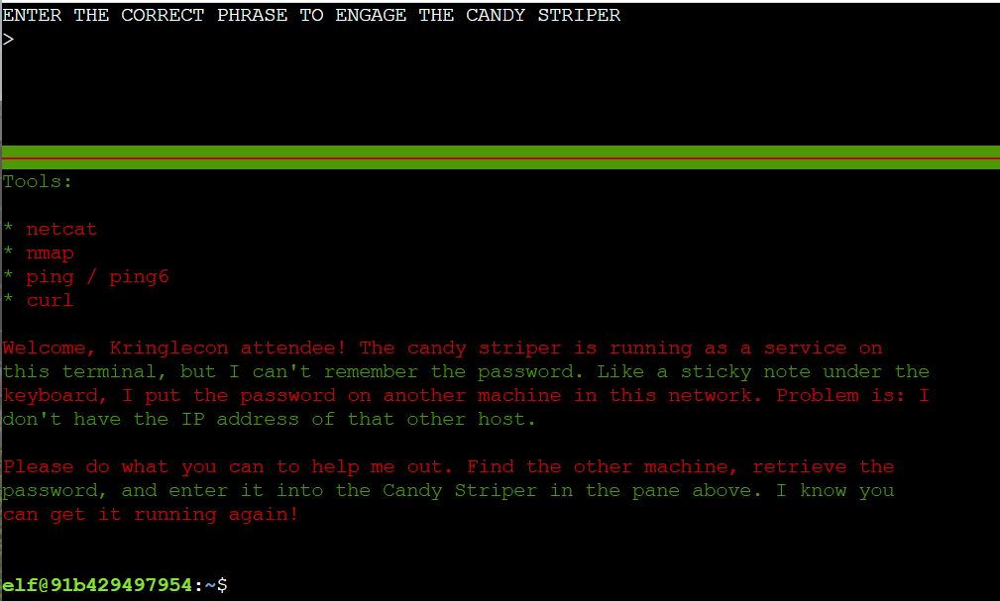

# Holiday Hack _Unofficial_ Help & FAQ

# General Help
#### I'm having issues registering or resetting my password
  - Email [support@holidayhackchallenge.com](mailto:support@holidayhackchallenge.com) for assistance
#### It seems like one of the challenges is broken.  Who do I notify?
  - First check the Kringle Con status page - https://status2022.kringlecon.com/.  Asking in the Discord channel for that challenge if others are experiencing problems.  You can also @concierge or @moderator to take a look.
#### What if there's a really big problem with a challenge?
  - You can always DM a concierge or moderator.  You can also open a github issue - https://github.com/CounterHack/HolidayHack2022/issues

# General Technical Help
#### I'm unable to copy/paste in a terminal challenges.  How do I fix this?
  - This behavior is usually caused by the mouse highlighting text in the tmux session (how the challenge provides a 'split' screen) conflicting with wetty (how the challenge is providing shell access).  Below is an example from the ipv6 challenge of HHC 2021 that has this problem.
  - 
  - One way to get around this is to turn off the mouse within the tmux session (so wetty can use the browser/system mouse to select and copy/paste text).  However, when you do this, you can no longer select between the top/bottom panes of the split screen.
    - `tmux set -g mouse off`
  - A way to provide you the ability to change tmux session panes is the below commands.  This winds the page up key to select the top pane; page down to select the bottom pane.
    - `tmux bind-key -T root PageUp select-pane -t 0`
    - `tmux bind-key -T root PageDown select-pane -t 1`
  - To re-enable the tmux mouse, use the following command
    - `tmux set -g mouse on`

# Challenges
This is not intended to be hints for the various challenges, but more specific guidance on common technical problems and questions that arise.  If you're looking for a nudge in the right direction, we suggest going to the Discord channel for that challenge.
#### 1-a-thing
- **Foo**
  - Bar

# Write-ups
#### When can I publish my writeup on my website/github/linkedin?
  - We kindly ask that you refrain from publicly publishing any answers, write-ups, or walkthroughs until after our submission deadline of January 7, 2022. Once that passes, please feel free to publish!

#### How do I know my writeup has been received?  When will be writeup be reviewed?
  - The Counter Hack team receives hundreds of submissions, so be patient as they work their way through the backlog.  Candy canes and hot chocolate can only keep fueled for so long before they need to take a break!  :smile: 

#### What are the rules for write-ups?
  - The general guidelines are 50 pages max and submitted by Jan 7.  If you're looking for some inspiration, you can review previous years winning entries - https://www.holidayhackchallenge.com/past-challenges/

# The More You Know
#### This is my first Holiday Hack Challenge.  Where do I start?
  - There's a great video create by Concierge Andy here - https://www.youtube.com/watch?v=THeHVLvJXO8 
  - Join the Discord server to connect with others working their way through the challenges - https://discord.gg/Wbmx92rWW3
#### I never want this to end!
  - Did you know that multiple previous years of HHC challenges are __still__ available? https://holidayhackchallenge.com/past-challenges/